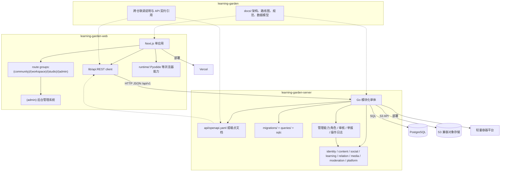
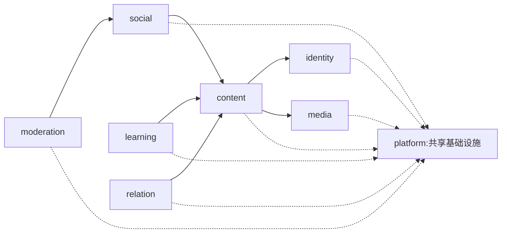

# 架构设计

本文回答:**多用户社区形态下,整体架构能否保持低耦合?职责分层是否清晰?后台管理系统如何纳入整体架构?**
结论先行,见第 12 节。

---

## 1. 核心洞察:模块是视图,多用户是叠加的维度

功能规划列了 8 个学习模块(Roadmap、Knowledge Graph、Concepts、Papers、Experiments、Review、Journal、Portfolio)。把它们当 8 个独立子系统设计,必然走向蜘蛛网式高耦合。

真正的洞察分两层:

1. **这 8 个模块不是 8 个子系统,而是同一份内容数据的 8 种投影。** 让所有模块只依赖底层内容,模块之间互不依赖——这是一个 hub 为"数据"的 hub-and-spoke。
2. **"多用户"和"社区"不是重写,而是在内容之上叠加两样东西**:给每条内容加 `归属(owner)` 与 `可见性(visibility)` 两个维度;在内容之上增加一个 `社交层`(评论、讨论、关注、动态流)。学习模块本身的视图性质不变。
3. **后台管理系统不是另一个业务系统,而是平台治理层。** 它读取并管理已有的用户、内容、社交与举报数据,通过管理员角色和管理接口执行审核、防滥用、开放注册控制与管理操作审计。

因此整体架构没有被社区化和后台管理推翻,只是多了"归属/可见性"、"社交层"和"治理层"。

---

## 2. 系统形态与策略

- **形态**:完整社区。内容可公开,公开内容可被浏览、评论、讨论。
- **策略**:先小范围(自己 + 朋友)起步,预留公开注册接缝。
- **后台管理系统**:必须存在,但不单独拆应用。管理员通过同一个 `web` 应用的 `(admin)` 路由组进入后台,后端通过 `identity`、`moderation` 以及相关领域模块的 service 接口提供管理能力。
- **架构原则——地基与功能分期**:

> 多用户**地基**(认证、用户体系、内容归属、多租户隔离、管理员角色)在 M0 就建;社区**功能**(评论、讨论、关注、动态流)分期到 M4 才建;后台**治理功能**(举报、审核、防滥用、开放注册控制)分期到 M6 完整建设。

原因:地基后补等于重写(给一个单用户系统塞进多租户极其痛苦);而社区功能和后台治理功能是挂在地基上的,后加成本低。且别在没人的平台上先建讨论区和复杂审核台——社区功能要等"先小范围"那批朋友就位时再上,完整后台治理要等准备开放注册时再补齐。

---

## 3. 组件与部署单元

三个运行单元 + 两个存储:



```text
┌──────────────── web (Next.js 单应用) ─────────────────┐
│  (community) 社区   (workspace) 我的学习空间            │
│  (studio) 创作      (admin) 后台管理系统                │
│  —— 按角色(访客 / 用户 / 管理员)分路由组,鉴权在路由层 │
└───────────────────────────┬───────────────────────────┘
                            │ HTTP / JSON  (REST, /api/v1)
┌───────────────────────────▼───────────────────────────┐
│           api (Go 模块化单体 modular monolith)          │
│  identity content social learning relation media       │
│  moderation(举报/审核/操作日志) + platform(共享基础设施)│
└──────────────┬─────────────────────────┬───────────────┘
               │                         │
       ┌───────▼────────┐       ┌────────▼─────────┐
       │   PostgreSQL   │       │   对象存储(S3)   │
       │ 内容/进度/社交  │       │ 图片/notebook/文件 │
       └────────────────┘       └──────────────────┘
```

- **web** 是**一个** Next.js 应用,不拆成多个。访客、登录用户、管理员是同一应用内的不同角色,用 Next.js route group + 路由层鉴权区分。多用户不等于多应用,有后台管理系统也不等于要拆出独立 admin 应用。
- **后台管理系统** 是 `web (admin)` + `api` 管理能力的组合。前端提供管理员工作台;后端负责管理员授权、举报处理、内容/评论管理、防滥用控制和管理操作审计。
- **api** 是**一个** Go 服务(模块化单体),内部按领域硬隔离。不上微服务——对"先小范围"是巨大过度工程;模块化单体既简单,又把"将来要拆"的接缝留好了。
- **PostgreSQL** 持有所有结构化数据。**对象存储**持有上传的文件(S3 兼容)。

仓库边界与运行单元保持一致但不改变架构:

- `learning-garden-web` 持有 `web` 源码与前端部署配置。
- `learning-garden-server` 持有 `api` 源码、数据库迁移、SQL 查询、API 契约与后端部署配置。
- 当前文档仓持有跨仓架构、规范、路线图与本地联调说明。
- `web` 不依赖 `api` 源码,只依赖 REST 契约与环境变量配置的 API 地址。

---

## 4. 分层架构

依赖只能自上而下,跨层、向上均禁止。

### 4.1 web 的分层

```text
L4  视图层    features/* —— 8 学习模块 + 社区模块,互不 import
L4  管理视图  app/(admin) + features/admin —— 后台管理系统,只能调用 lib/api
L3  数据层    lib/api    —— 唯一与后端通信的客户端,按后端领域组织
L2  能力层    runtime/   —— Pyodide 等能力,接口隔离
L1  —        (无;真正的领域逻辑在后端)
```

### 4.2 api 的分层(每个领域模块内部)

```text
handler     接口层    —— HTTP 路由、请求/响应、鉴权中间件
service     领域服务  —— 业务规则、授权判定、跨领域协调
repository  仓储层    —— PostgreSQL 访问(SQL)
domain      领域模型  —— 实体与类型
```

| 层 | 负责 | 不负责 |
| --- | --- | --- |
| handler | HTTP 传输、参数校验、鉴权 | 业务规则 |
| service | 业务逻辑、授权(谁能读写什么) | SQL、HTTP |
| repository | 数据库读写 | 业务规则 |
| domain | 实体与类型定义 | 任何行为 |

---

## 5. 后端模块化单体

`api` 内部按**领域(bounded context)**拆成模块,每个模块自带 handler/service/repository/domain 四层。

| 模块 | 职责 |
| --- | --- |
| `identity` | 用户、认证、会话、个人资料、角色 |
| `content` | 概念/论文/实验/路线/复盘——含归属 `owner` 与可见性 `visibility` |
| `social` | 评论、讨论、关注、动态流、通知 |
| `learning` | 个人学习进度、复习卡与 SM-2 算法 |
| `relation` | 关系索引、反向链接 |
| `media` | 文件/资源上传与存取 |
| `moderation` | 后台治理:举报、审核、管理操作日志、防滥用与开放注册控制 |
| `platform` | 共享基础设施:DB 连接池、配置、中间件、日志、错误处理 |

### 5.1 模块依赖图(单向无环)



```text
moderation ──→ social ──→ content ──→ identity
                  │           │  │
learning ─────────┼───────────┘  │
                  │              ↓
relation ─────────┘            media
（platform 被所有模块共享,自身不依赖任何领域模块）
```

- `identity` 不依赖任何领域模块。
- `content` 依赖 `identity`(归属)、`media`(资源)。
- `social`、`learning`、`relation` 依赖 `content`;`content` **不知道**它们存在。
- 整张图是 DAG,无环。

### 5.2 模块间低耦合的强制规则

1. **模块之间只通过对方的 service 接口通信**,禁止跨模块直接访问对方的 repository 或数据库表。
2. 例:`social` 要显示评论者昵称 → 调 `identity` 的 service,不直接查 `users` 表。
3. `content` 完全不依赖 `social`——评论靠 `target_id` 挂在内容上,依赖方向是 `social → content` 单向。
4. 依赖方向必须符合 5.1 的 DAG,不得成环。
5. 用 Go 包可见性 + 依赖检查工具(`depguard`)在 CI 强制,等价于前端的 ESLint 分层规则。

---

## 6. 后台管理系统

后台管理系统是平台治理层,服务对象是管理员,不是普通用户的学习工作台。它与用户端共用同一个 `web` 应用和同一个 `api` 服务,但通过 `(admin)` 路由组、管理员角色和 service 层授权与用户端隔离。

### 6.1 管理端边界

| 层面 | 设计 |
| --- | --- |
| 前端入口 | `app/(admin)` 路由组,例如 `/admin`,只允许 `role='admin'` 访问 |
| 前端模块 | `features/admin`,负责管理工作台、举报队列、内容审核、用户与注册控制等页面 |
| API 边界 | 仍通过 `lib/api` 调用 REST `/api/v1`,不直接访问后端源码或数据库 |
| 后端授权 | handler 只识别会话;是否允许管理操作必须在 service 层校验 `role='admin'` |
| 后端模块 | `identity` 提供用户/角色,`moderation` 提供举报、审核、操作日志、防滥用控制,必要时通过 service 调用 `content` 与 `social` |

### 6.2 管理端功能

后台管理系统分为两层:

1. **M0 起必须存在的后台地基**
   - 管理员角色 `admin`;
   - `/admin` 路由保护;
   - 管理端占位工作台;
   - 后端 service 层的管理员授权规则;
   - 管理操作统一返回可审计的错误与日志结构。
2. **M6 完整建设的治理功能**
   - 举报队列:查看、定位、处理 `reports`;
   - 内容审核:下架、恢复、删除公开内容;
   - 评论/讨论管理:删除违规评论、关闭违规讨论;
   - 用户管理:查看用户资料、公开内容、角色状态,必要时限制账号行为;
   - 开放注册控制:公开注册开关、防滥用、限流策略;
   - 管理操作日志:记录操作者、目标、动作、原因和时间。

### 6.3 依赖方向

`moderation` 可以调用 `social`、`content`、`identity` 的 service 接口完成管理操作,但禁止直接访问它们的 repository 或表。被管理模块不反向依赖 `moderation`;也就是说,用户端内容和社交模块不因为有后台管理系统而被反向污染。

---

## 7. 内容模型:归属与可见性

每条内容实体都带两个维度:

- `owner_id` —— 内容属于哪个用户。只有 owner 能修改自己的内容(授权在 service 层判定)。
- `visibility` —— `private`(仅自己)或 `public`(进入社区,可被浏览/评论)。

**社区 = 所有 `public` 内容的聚合视图 + social 社交层。** 不存在"全民共建的维基词条"——那是另一个产品。所谓"协作",初期就是评论与讨论;实时协同编辑属于远期,不进入当前架构。

8 个学习模块的视图性质不变,只是查询时多了归属/可见性的过滤条件:`workspace` 看自己的全部内容,`community` 看所有人的 `public` 内容。

---

## 8. 两个数据平面

仍然严格区分,只是现在都落在 PostgreSQL,作为不同领域模块:

| | 撰写内容平面 | 用户运行态平面 |
| --- | --- | --- |
| 内容 | 概念、论文、实验、路线、复盘 | 学习进度、复习卡熟练度、任务勾选 |
| 模块 | `content` | `learning` |
| 性质 | 用户创作,相对稳定 | 随学习高频变化 |

**规则:`content` 的实体表里不出现学习状态字段**(`status` 等)。状态在 `learning` 模块,以 `user_id + content_id` 为键。两者通过 id 关联,但分属不同模块、不同表。

---

## 9. 关系索引

内容之间的关联(概念→论文、概念→前置概念、实验→概念)由作者**单向**录入。反向链接("这篇论文被哪些概念引用")由 `relation` 模块统一查询派生,**不手工维护**。

关系存为边表(见 [05-data-model.md](./05-data-model.md))。`relation` 模块是唯一持有"全局关系视图"的地方,任何模块要查关联都问它,不自己爬数据。

---

## 10. 能力隔离

浏览器内运行 Python(Pyodide)封装在 web 的 `runtime/` 里单一 `PythonRuntime` 接口后,懒加载,只有 `<RunnablePython>` 组件使用。其余代码不知道 Pyodide 存在,将来可替换。

注:Pyodide 只能跑 numpy 系,跑不了 PyTorch/RL;框架代码用 `<PaperCode>` 挂 Colab 链接(详见 feature plan 第 14 节)。

---

## 11. 演进性

- **加远期模块**(如训练仪表盘):新增一个领域模块 + web 视图,不触碰现有模块。
- **从模块化单体拆分**:若某模块将来需独立伸缩,因其已是边界清晰的领域模块、只通过 service 接口被调用,可整体抽出为独立服务,改动面受控。这正是"先小范围、预留开放"换来的收益。
- **开放公开注册**:`identity` 从 M0 就是多用户的,开放注册只是放开注册入口 + 启用后台管理系统中 `moderation` 的防滥用功能,不动核心架构。
- **后台管理增强**:新增管理页面或管理动作时,优先扩展 `(admin)` 路由和 `moderation` service;只有出现独立伸缩、独立权限域或独立部署需求时,才重新评估是否拆出独立后台应用。
- **前后端独立发布**:`web` 与 `api` 分仓部署,通过 `/api/v1` 契约协调。独立发布不等于独立领域服务,更不引入微服务。

---

## 12. 评估结论:低耦合与分层是否成立

**职责分层——清晰。** web 四层、api 每个领域模块内部四层,依赖严格单向向下。api 进一步按领域(bounded context)横向切成 8 个模块,每个模块职责单一。

**模块耦合——低,且可验证。**
- 8 个学习模块是同一内容的视图,彼此零 import,跨模块跳转只走 URL;
- 后端领域模块只通过 service 接口通信,依赖构成单向 DAG(第 5.1 节),禁止跨模块碰表;
- "归属/可见性"作为内容的两个维度,而非散落各处的判断,授权集中在 service 层;
- 社交层(`social`)单向依赖 `content`,`content` 不被反向污染;
- 后台管理系统作为治理层单向依赖被管理模块的 service 接口,不会让用户端模块反向依赖管理模块;
- 内容平面与运行态平面分离,杜绝状态字段污染内容。

**多用户社区和后台管理系统没有破坏低耦合**,因为它们是"叠加维度 + 叠加层",不是"重写"。

**前提条件(否则结论不成立):**
1. 前端 ESLint 分层规则 + 后端 `depguard` 模块依赖规则必须在 CI 强制——架构靠工具守护才不腐化。
2. 坚持地基/功能分期:M0 就把多用户地基建对,社区功能 M4 再加。
3. 内容表不混入运行态状态字段。
4. `web` 与 `api` 的 REST 契约必须显式维护,避免跨仓后接口漂移。
5. 新功能一律先归类到某个领域模块的某一层,不允许图省事跨层、跨模块。

满足以上前提,这套架构在低耦合与分层清晰度上**成立且可长期维护**。最大的现实风险不是架构,而是工程量:完整社区 + 学习 OS 体量不小,务必遵守 20% 时间预算与 M0→M6 分期(见 [03-roadmap.md](./03-roadmap.md))。
